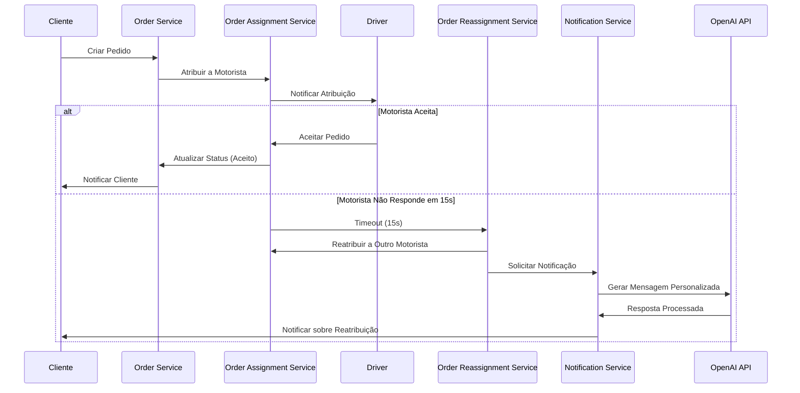
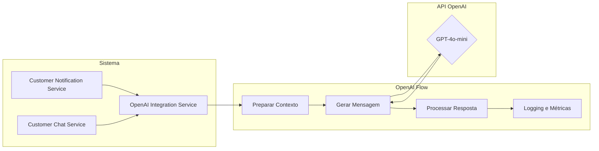

# Order Reassignment Notification System

## Visão Geral
Este sistema integra um serviço de atribuição de motoristas com a API da OpenAI (gpt-4o-mini) para fornecer notificações automáticas aos clientes sobre alterações no status dos seus pedidos, especialmente em casos de reatribuição automática quando motoristas não respondem dentro do tempo estipulado.

## Arquitetura de Integração

### Fluxo de Atribuição e Reatribuição de Pedidos



### Integração com OpenAI



### Camadas da Aplicação
1. **Camada de Serviço de Pedidos**: Gerencia o ciclo de vida dos pedidos e a atribuição aos motoristas
2. **Camada de Integração**: Conecta o sistema de pedidos com a API da OpenAI
3. **Camada de Comunicação com Cliente**: Gerencia o canal de comunicação com o cliente

### Componentes Principais
- **Driver Assignment Service**: Gerencia a atribuição de motoristas e o controle de tempo
- **Order Status Manager**: Monitora e atualiza o status dos pedidos
- **Reassignment Processor**: Implementa a lógica de reatribuição automática
- **OpenAI Integration Service**: Integra com a API da OpenAI para gerar respostas personalizadas
- **Customer Notification Service**: Envia notificações aos clientes

### Tecnologias Utilizadas
- **Backend**: Node.js com Express
- **Database**: Sistema de armazenamento em memória
- **Integration**: API da OpenAI (gpt-4o-mini)
- **Logging**: Winston para geração de logs detalhados
- **Testing**: Jest para testes unitários e de integração

### Fluxo de Processo
1. Pedido é criado e atribuído a um motorista
2. Sistema inicia timer de 15 segundos
3. Se o motorista aceita dentro do prazo, status atualizado para "accepted"
4. Se não responde em 15 segundos, sistema reatribui automaticamente a outro motorista
5. Quando uma reatribuição ocorre, o sistema registra logs detalhados
6. Clientes podem consultar o status via chatbot
7. OpenAI API gera respostas personalizadas baseadas no status atual e histórico do pedido

## Controle de Qualidade da Integração

### Requisitos Implementados como Código
- Testes automatizados validam todos os cenários de negócio
- Schemas de validação garantem integridade dos dados
- Contratos de API formalizados via OpenAPI/Swagger
- Monitoramento de SLAs implementado como código

### Métricas de Qualidade
- **Tempo de Resposta**: Monitoramento do tempo de resposta da API da OpenAI
- **Taxa de Sucesso**: Porcentagem de integrações bem-sucedidas
- **Qualidade da Resposta**: Avaliação da relevância das respostas geradas

## Exemplos de API Requests

### Criar um Pedido
```bash
curl -X POST http://localhost:3000/api/orders \
  -H "Content-Type: application/json" \
  -d '{
    "customerId": "c123456789",
    "orderDetails": {
      "items": [
        {
          "name": "Pizza Margherita",
          "quantity": 1,
          "price": 29.90
        }
      ],
      "totalAmount": 29.90,
      "deliveryAddress": "Rua Exemplo, 123",
      "deliveryCoordinates": {
        "latitude": -23.5505,
        "longitude": -46.6333
      }
    }
  }'
```

### Atribuir Pedido a um Motorista
```bash
curl -X POST http://localhost:3000/api/orders/{orderId}/assign \
  -H "Content-Type: application/json" \
  -d '{
    "driverId": "d123456789"
  }'
```

### Registrar Resposta do Motorista
```bash
curl -X POST http://localhost:3000/api/orders/{orderId}/driver-response \
  -H "Content-Type: application/json" \
  -d '{
    "driverId": "d123456789",
    "accepted": true
  }'
```

### Consultar Status do Pedido
```bash
curl -X GET http://localhost:3000/api/orders/{orderId}/status
```

### Enviar Mensagem ao Chatbot
```bash
curl -X POST http://localhost:3000/api/chat \
  -H "Content-Type: application/json" \
  -d '{
    "orderId": "{orderId}",
    "customerId": "c123456789",
    "message": "Onde está meu pedido?"
  }'
```

## Instruções de Uso

### Pré-requisitos
- Node.js v16+
- Chave de API da OpenAI

### Instalação
```bash
npm install
```

### Configuração
1. Copie o arquivo `.env.example` para `.env`
2. Configure sua chave da API da OpenAI e outras variáveis de ambiente

### Execução
```bash
npm start
```

### Testes
```bash
npm test
```

## Documentação Adicional
A documentação detalhada dos componentes está disponível como código nos diretórios:
- `/docs/architecture`: Diagramas e descrições da arquitetura
- `/docs/api`: Documentação da API e contratos
- `/docs/integration`: Documentação específica da integração 